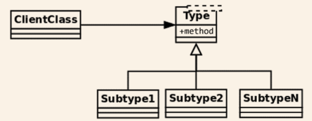
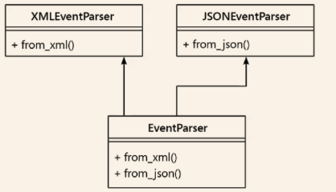
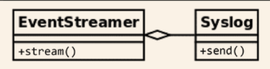
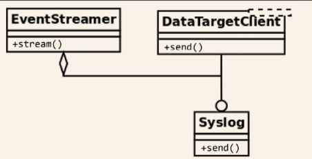

# SOLID Principles
SOLID principles entail a series of good practices to achieve better quality software. SOLID stands for:  
1. S: Single responsibility  
2. O: Open Close principle  
3. L: Liskov's substitution principle  
4. I: Interface segregation principle  
5. D: Dependency Inversion Principle  

## Single Responsibility Principle
- A software component(a class or function in general) should have only one responsibility.
- A class should be in charge of doing just one concrete thing and hence it must have only one reason to change.
- Only if one thing on the domain problem changes will the class have to be updated.
- In all cases, avoid god objects i.e avoid objects with multiple responsibilities. These objects group different unrelated behaviours, thus making them harder to maintain.
- When looking at a class, if you find methods that are mutually exclusive and do not relate to each other, they are the different responsibilities and the class needs to be broken down into smaller classes.

### A class with too many responsibilities
Let us assume that a class, `SystemMonitor`, is responsible for reading information from the source(log files), identify actions corresponding to each particular log, and finally send these events to an external agent.  


| SystemMonitor      |
|--------------------|
| + load_activity()   |
| + identify_events() |
| + stream_events()   |


- The problem is that this class, i.e `SystemMonitor`, defines methods that correspond to actions that are orthogonal: each can be done independently of the rest.  
- The class is rigid and hence difficult to maintain, extend, and reuse. If we make any changes to a method, we need to modify the `SystemMonitor` class.
- The class has multiple responsibilities and each responsibility entails a reason why the class might need to be modified.

### Distributing the responsibilities
- Break each method into a separate class


- Now, each of the classes contains methods that are independent of the rest.
- Each class encapsulates a specific set of methods that are independent of the rest
- Changes to any of these classes do not impact the rest. Changes are now local, the impact is minimal, and each class is easier to maintain.
- The new classes define interfaces that are not only more maintainable but also reusable. We can now use the SystemMonitor class in a different module without importing any code related to ActivityWatcher and Output.  
- Each class may have multiple methods that correspond to the same logic.

**Note: The idea is to design software that can be easily extended and changed, and that can evolve toward a more stable version.**    

#### What are the right boundaries to separate responsibilities?

*Start writing a monolithic class, in order to understand what the internal collaborations are and how responsibilities are distributed. This will help you get a clearer picture of the new abstractions that need to be created.*  

## The Open Close Principle

Encapsulation is the bundling of data and the methods that operate on that data into a single unit. A class is a form of encapsulation. Encapsulation restricts the direct access to some components of an object.   
The open close principle states that:   

>When designing a class, for instance, we should carefully encapsulate the implementation details, so that it has good maintenance, meaning that we want it to be open to extension but closed to modification.    

- Open Close Principle, OCP, focuses on writing code that is easy to maintain and extensible.  
- When something changes in the domain problem, we want to add new changes without modifying the existing code.  

### Examples of not following the OCP  


- The above design appears extensible. Adding a new event involves creatinga  new subclass of Event class and that's it. 
    - This design isn't extensible. The identification of event is done in the `identify()` method inside the `SystemMonitor` class. The method relies on the actual implementation details of each event.

```python
@dataclass
class Event:
    raw_data: dict 
class UnknownEvent(Event):
    """A type of event that cannot be identified from its data."""
class LoginEvent(Event):
    """A event representing a user that has just entered the system."""
class LogoutEvent(Event):
    """An event representing a user that has just left the system."""
class SystemMonitor:
    """Identify events that occurred in the system."""
    def __init__(self, event_data):
        self.event_data = event_data
    def identify_event(self):
        if (
            self.event_data["before"]["session"] == 0
            and self.event_data["after"]["session"] == 1
        ):
            return LoginEvent(self.event_data)
        elif (
            self.event_data["before"]["session"] == 1
            and self.event_data["after"]["session"] == 0
        ):
            return LogoutEvent(self.event_data)
        return UnknownEvent(self.event_data)
```

- As you can see, adding a new event will require adding additional logic to the `identify()` method inside the `SystemMonitor` class.

But we want to be able to add new events without changing this method. How can we do that?  

### Refactoring the events system for extensibility  

- Issue with previous design: The `SystemMonitor` class ws interacting directly with the concrete classes.  
- To honor the OCP, we design towards abstraction.
- Delegate the logic for each particular type of event to its corresponding class   


**Updated Code**  
```python
class Event:
    def __init__(self, raw_data):
        self.raw_data = raw_data
    @staticmethod
    def meets_condition(event_data: dict) -> bool:
        return False
class UnknownEvent(Event):
    """A type of event that cannot be identified from its data"""
class LoginEvent(Event):
    @staticmethod
    def meets_condition(event_data: dict):
        return (
            event_data["before"]["session"] == 0
            and event_data["after"]["session"] == 1
        )
class LogoutEvent(Event):
    @staticmethod
    def meets_condition(event_data: dict):
        return (
            event_data["before"]["session"] == 1
            and event_data["after"]["session"] == 0
        )
class SystemMonitor:
    """Identify events that occurred in the system."""
    def __init__(self, event_data):
        self.event_data = event_data
    def identify_event(self):
        for event_cls in Event.__subclasses__():
            try:
                if event_cls.meets_condition(self.event_data):
                    return event_cls(self.event_data)
            except KeyError:
                continue
        return UnknownEvent(self.event_data)

```

- Now supporting new classes only involves a new class that uses `Event` as the base class and implement its own `meets_condition()` method.  
- The above implementation now supports OCP principle.  


## Liskov's substitution principle  
It states that there is a series of properties that an object must adhere to to preserve the reliability of its design. For any class, a client should be able to use any of its subtypes indistinguishably without even noticing, and therefore without compromising the expected behaviour at runtime. 

>If *S* is a subtype of *T*, then object of type *T* may be replaced by objects of type *S*, without breaking the program.  

**Example**  
Let us assume that a class `ClientClass` needs to interact with objects of another class `Type`
. Generally, `Type` will be an interface, abstraction, or a class without a concrete interface. `Type` will have multiple subclasses. According to LSP, if the hierarchy is correctly implemented, the `ClientClass` will be able to work with instances of any of the instances without even noticing.  



- LSP is about creating correct hierarchies so that classes derived from a base one are polymorphic along the parent one, with respect to the methods on their interface.


## Interface Segregation  

- An interface is represented by the set of methods and properties an object exposes. 
- The interface separates the definition of the exposed behavior for a class from its implementation.
- In pythoh, abstract base class facilitate the process of separation of method definition and implementation.

### An interface that provides too much

```python
from abc import ABC, abstractmethod
class EventParser(ABC):
    def from_xml():
        pass
    def from_json():
        pass
```
- The above implementation is not optimal because we may have a class that doesn't need to parse events from json.  But, if that class inherits from `EventParser` it must implement the `from_json()` method introducing a redundancy.  

### The smaller the interface, the better  
**Solution: Separate this into two different interfaces**  
- This will make the code reusable and eliminate redundancy.  
- We can still achieve the previous functionality by making our event parser class implement both interfaces.



- With the above desing, the system is more flexible.  
- Failure to comply with this principle will create an interface that will be coupled with orthogonal functionality, and this derived class will also fail to comply with the SRP

### How small should an interface be?
The fact that an interface should be small should be understood in terms of cohesion- it should do one thing. This doesn't necessarily mean that an interface should have only one method, it could have multiple related methods.  

## Dependency Inversion

- Used to make our code independent of things that are fragile, volatile, or out of our control.  


>Abstractions have to be organized in such a way that they do not depend on details, but rather the other way around- the details(concrete implementations) should depend on abstractions.  

### A case of rigid dependencies

We have to classes, `EventStreamer` and `Syslog` that interact as shown in the figure:  


- The `stream()` method in the `EventStreamer` class needs to call the `send()` method fo the `Syslog` class to send data to `Syslog`.
- If something changes in the way we want to send data to `Syslog`, we need to modify the `stream()` method inside `EventStreamer`.  

Above problems can be solved by making `EventStreamer` work with an interface rather than a concrete class. The new design is shown below:  





- Now `EventStreamer` is working with an interface `DataTargetClient` rather than its concrete implementation i.e `Syslog`
- Every data target now must implement the interface and implements its own `send()` method. `EventStreamer` need not worry how the `send()` method is implemented, it just need to call it.  


## References

- Clean Code in Python, Mariano Anaya

